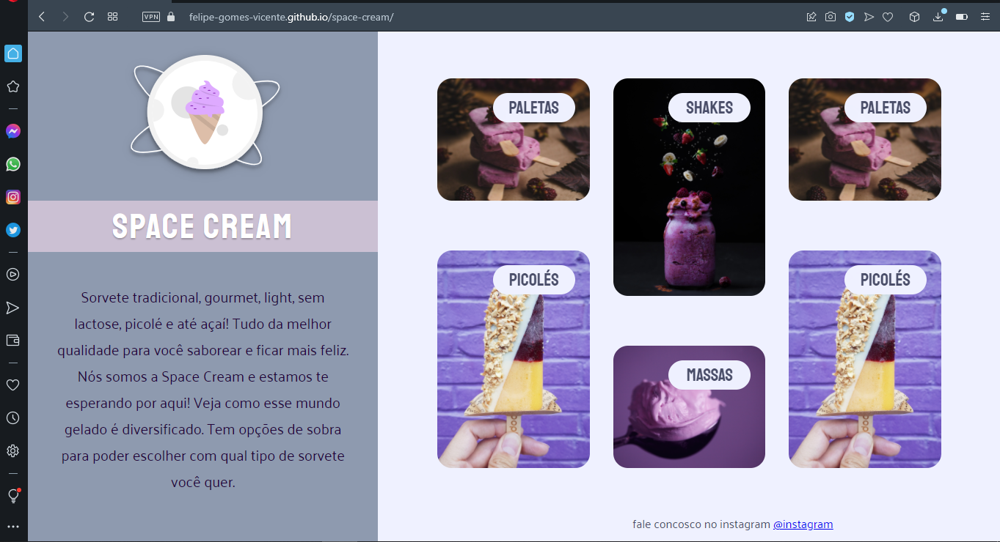
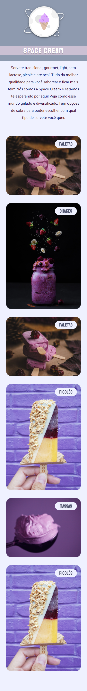

# Space Cream

<h1 align="center">
    
</h1>

<br>

### 💻 Space Cream

Build a responsive web page Mobile first concept from scratch using the prototype 
layout available in figma.
Strengthen my knowledge of HTML and CSS GRID apply concepts and what was seen in
the projects Stage 2 Stage 3 versions apply to the project, animations and transitions 
in CSS.

Watch it in action Deploy: [Click Here](https://felipe-gomes-vicente.github.io/space-cream//)

What was developed:

- Structuring HTML with semantic tags;
- Mobile First;
- I challenged myself and applied Responsiveness with CSS GRID;
- Flexible measurement unit;
- Breakpoints with media media query;
- Import external CSS file into the project;
- Applying custom fonts (typography) in the CSS file and starting the external CSS;
- Working with colors and fonts;
- Aligning and positioning, spacing texts and elements;
- Applying the spacing;
- Borders and element classifications;
- The Box Model concept of CSS flexbox and applying CSS GRID;
- CSS animations and transitions;
- Use CSS variables to manipulate the project's color palette and fonts;
- Reset CSS removing possible inconsistencies between different browsers;
- Project file system structure separated by folder;

I applied my knowledge of the Explorer from Rocketseat concepts in a practical way 
to this project, with the lessons:

- Introduction to HTML and CSS;
- Getting to know new concepts of HTML and CSS;
- Advancing in HTML and CSS;
- Responsiveness;
  
<br />

- [EXPLORER - Rocketseat](https://www.rocketseat.com.br/explorer)
- [Design Figma - Space Cream Mobile](https://www.figma.com/file/drBBktNRdtCIUiN4cZk4yo?node-id=0:1)
- [Design Figma - Space Cream Desktop](https://www.figma.com/file/pddZCuQIRLjk5dEHQ4L4YR?node-id=0:1)

## Image from the final project:
 

 <br />

 <p>Image Space cream Mobile</p>



## 🧪 Tools

Application developed using the following tools:

- [HTML5](https://www.w3schools.com/html/default.asp)
- [CSS3](https://www.w3schools.com/css/default.asp)

## 🚀 Getting started

Live server with VScode or just clone folder and access index.html

### Programs needed to Getting started

- [Live Server (Opcional)](https://marketplace.visualstudio.com/items?itemName=ritwickdey.LiveServer)
- [Visual Studio Code - Vscode](https://code.visualstudio.com/)

Clone the project and access the folder.

```bash
$ git clone https://github.com/felipe-gomes-vicente/rocket-sect.git
$ cd rocket-sect
```

## 📝 License

This project is under the MIT license. See the file [LICENSE](LICENSE.md) for more details.

---

&nbsp;

<p align="center">Done with 💜 by Felipe Vicente👋</p>

- ## My LinkedIn - [](https://www.linkedin.com/in/felipe-gomes-vicente/)
